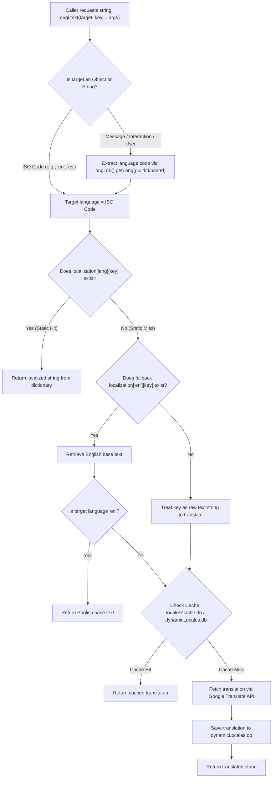

# Comprehensive Localization Guide & Architecture Manual

This document provides the definitive architectural blueprint, development rules, string migration directives, and operational guidelines for **OugiBot's Localization System** (`localization.js` & `text.js`).

---

## 1. 🏗️ Localization Architecture

### 1.1 Dual-Tier Translation Pipeline
OugiBot employs a hybrid, two-tiered localization model combining **static dictionary lookups** for instant, high-fidelity localizations and **dynamic on-the-fly machine translation** with multi-tier fuzzy caching for unmapped languages:



### 1.2 Language Resolution Hierarchy
When `ougi.text(msgOrTarget, key)` is invoked, target language resolution follows strict precedence:
1. **Explicit Language Code**: If a 2-letter ISO string (e.g., `'en'`, `'es'`, `'fr'`) is provided, it is evaluated directly.
2. **Guild Configuration**: For Discord messages or interactions originating in a guild, the bot queries `ougi.db().getLang(guildId)`.
3. **User Preference**: For direct messages (DMs), user-level settings are evaluated.
4. **Default Fallback**: If no specific preference is configured or database returns `undefined`, the bot defaults to `'en'`.

### 1.3 Static Dictionary vs. Dynamic Cache
- **Static Dictionary (`function/localization.js`)**:
  - Central repository of curated, hand-crafted translations (primarily English `'en'` and Spanish `'es'`).
  - Contains all interface strings, help menus, error messages, economy responses, diagnostic log embed structures, root commands, and AI story scenarios.
- **Dynamic Caches (`localesCache.db` & `dynamicLocales.db`)**:
  - Persistent SQLite databases that store translations fetched at runtime for languages not yet hardcoded in `localization.js`.
  - Automatically deduplicates and caches translations to prevent redundant HTTP requests to Google Translate API.

---

## 2. 📜 String Migration Directives

### 2.1 Standard Function Call Signature
All localization queries must use the centralized `ougi.text` resolver:

```javascript
// Asynchronous lookup (default)
const text = await ougi.text(msgOrLang, "localizationKey");
```

### 2.2 Placeholder Replacement Standard
Strings requiring dynamic variable interpolation (e.g., usernames, timestamps, amounts, channel names) use curly brace tokens `{token}`.

- **Token Syntax**: `{variableName}` (e.g., `{user}`, `{guild}`, `{amount}`, `{timeStamp}`, `{command}`).
- **Replacement Pattern**: Always use chained global regular expressions `.replace(/{token}/g, value)` to replace all occurrences:

```javascript
// Localization Dictionary definition:
"balance_output": "**{user}**'s balance is **{amount} {currency}**."

// Code implementation:
const balanceTemplate = await ougi.text(msg, "balance_output");
const output = balanceTemplate
  .replace(/{user}/g, targetUser.username)
  .replace(/{amount}/g, userEco.money)
  .replace(/{currency}/g, guildEco.currency);

await msg.channel.send(output);
```

### 2.3 Embed Localization Pattern
When localizing Discord `EmbedBuilder` objects, localize all structural elements (titles, descriptions, field names, field values, and footers):

```javascript
const embed = new Discord.EmbedBuilder()
  .setTitle(await ougi.text(msg, "embed_titleKey"))
  .setDescription((await ougi.text(msg, "embed_descKey")).replace(/{user}/g, msg.author.username))
  .setColor("#FF008C")
  .addFields({
    name: await ougi.text(msg, "embed_fieldNameKey"),
    value: (await ougi.text(msg, "embed_fieldValueKey")).replace(/{status}/g, statusText)
  })
  .setFooter({
    text: await ougi.text(msg, "embed_footerKey"),
    iconURL: client.user.avatarURL({ dynamic: true, size: 4096 })
  });
```

### 2.4 Help Command Preset Integration (`helpPreset.js`)
All command help embeds must construct standardized help layouts using `ougi.helpPreset`:

```javascript
const embed = await ougi.helpPreset(msg, "commandName");
// ougi.helpPreset automatically populates:
// - Title ("helpTitle")
// - Prefix instructions ("helpPrefixExplanation")
// - Help explanation ("helpHelpExplanation")
// - Author metadata and Monogatari theme branding
```

---

## 3. 💡 Insights & Architectural Lessons Learned

1. **Context-Aware Asynchrony**:
   - In legacy code, many helper functions and logging routines were written synchronously. When migrating to `ougi.text()`, functions must either be converted to `async` or handle Promise resolutions with `.then()` if called from legacy synchronous callback listeners (such as stream writers in `audioCacheManager.js`).
2. **Preservation of Markdown & Discord Formatting**:
   - Custom emojis (`<:nou:726944701348970496>`), markdown headers (`__**Title**__`), timestamp tags (`<t:1700000000:t>`), and zero-width spaces (`\u200b`) must be strictly preserved inside `localization.js` values.
3. **Telemetry & Audit Traceability**:
   - Developer-facing notifications (`davidUserID` DMs and `consoleLogging` channel embeds) benefit significantly from localization. Having structured keys for developer audit alerts ensures uniform formatting for moderation reviews, crash tracebacks, and GDPR opt-out logs.
4. **Safety Against Null & Undefined Target**:
   - When calling `ougi.text(target, key)` where `target` might be null or undefined (such as during bot startup before any Discord message is received), always pass `'en'` as the fallback language parameter.

---

## 4. 🤖 RULES for AI Agents Implementing Localization

When modifying, adding, or refactoring code in OugiBot, every AI agent **MUST strictly adhere to the following rules**:

| Rule # | Directive | Rationale & Guidance |
| :--- | :--- | :--- |
| **RULE 1** | **No Blind Regex Replacement** | Never perform bulk regex find-and-replace across files. Every file, function, and string must be inspected line-by-line in context to ensure semantic accuracy. |
| **RULE 2** | **Synchronize `localization.js` First** | Always define the key and English translation in `function/localization.js` before referencing `ougi.text(target, "key")` in any module. |
| **RULE 3** | **Enforce Async Context** | Verify that `await ougi.text(...)` is called inside an `async` function. If the enclosing function is synchronous, convert it to `async` or use `.then(...)` promise chaining. |
| **RULE 4** | **Consistent Placeholder Tokens** | Use `{camelCase}` or `{meaningfulName}` tokens consistently across both the code `.replace()` calls and `localization.js` dictionary values. |
| **RULE 5** | **Zero Hardcoded User/Dev Messages** | No message sent to `msg.channel.send()`, `msg.reply()`, `interaction.reply()`, `client.users.cache.get().send()`, or `consoleLogging.send()` may contain hardcoded English/Spanish text strings. |
| **RULE 6** | **Mandatory AST Syntax Validation** | After making any code changes, always run `node -c <file>` or repository-wide AST checks (`node -e "..."`) to confirm 100% syntactic correctness before completion. |

---

## 5. 🚫 Exceptions and Technical Justifications

The following categories of strings are **strictly exempt** from `localization.js` migration:

1. **Parameter Separators (`::`)**:
   - *Justification*: The double colon `::` serves as OugiBot's universal argument tokenizer and CLI delimiter (e.g., `ougi embed ::title ... ::color ...`). Localizing this would break command syntax and user muscle memory.
2. **Exact Command Trigger Match Strings**:
   - *Justification*: Critical security and confirmation phrases such as `"I want to start using Ougi [BOT]."` and `"I want to opt out from using Ougi [BOT]."` represent exact cryptographic-like intent triggers required for GDPR compliance and data deletion.
3. **Database Schemas & Internal KV Keys**:
   - *Justification*: Identifiers such as `'localesCache'`, `'kb'`, `'economy'`, `'settings'`, `'reminders'`, `'raffles'`, and `'bump'` are internal database table names and SQLite primary keys. Modifying them would cause data corruption or schema desynchronization.
4. **External API Endpoints**:
   - *Justification*: Network URLs like `'https://translate.google.com'` and Discord CDN links are fixed internet protocol endpoints.
5. **HTTP User-Agents & Headers**:
   - *Justification*: Browser emulation strings (e.g., `'Mozilla/5.0...'`) and MIME types (`'application/json'`) are strict technical requirements of RFC HTTP specifications.
6. **Netscape Cookie Specifications**:
   - *Justification*: Header lines in cookie files (e.g., `'# Netscape HTTP Cookie File'`) are required by `yt-dlp` and `curl` standards for audio streaming authentication.

---

## 6. 🌐 Future Expansion & Multi-Language Maintenance

### Adding a New Static Language (e.g., French `'fr'`, Japanese `'ja'`)
To add first-class support for a new language:
1. Open [`function/localization.js`](file:///Users/hakkindavid/Documents/GitHub/OugiBot/function/localization.js).
2. Add a new top-level ISO key (e.g., `"fr": { ... }`).
3. Copy key-value pairs from the `"en"` dictionary and provide native translations. All `{placeholder}` tokens must remain unchanged.
4. Once added, `ougi.text(msg, key)` will automatically resolve to the new language for any server configured with `ougi lang fr`.

### Handling AI Generative Prompts vs. User Output
- **System Prompts (`ai_storytellerSystemPrompt`)**: Kept in `localization.js` to allow easy fine-tuning of AI personas and evaluation guidelines.
- **Dynamic Story Turns**: Evaluated dynamically through Pollinations AI / Google Translate pipeline.
